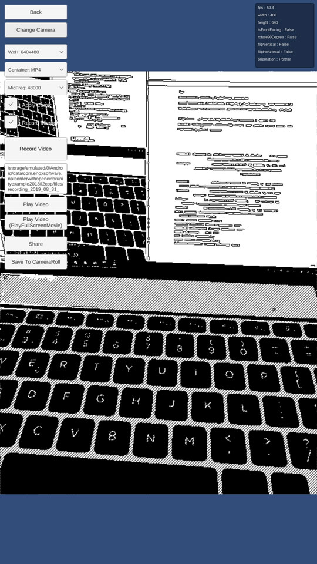

# NatCorder With OpenCVForUnity Example

* An example of a video recording app by using NatCorder and OpenCVForUnity.
* An example of native sharing and save to the camera roll using NatShare API.

## Environment
* Anddroid (Pixel, Nexus 7, Zenfone, SC-04E) / iOS (iPhone8, iPhone6)
* Unity >= 5.6.1f1
* Scripting backend MONO / IL2CPP
* NatCorder - Video Recording API1.3f2 ([https://assetstore.unity.com/packages/tools/integration/natcorder-video-recording-api-102645](https://assetstore.unity.com/packages/tools/integration/natcorder-video-recording-api-102645?aid=1011l4ehR))  
* NatShare - Mobile Sharing API 1.1f2 ([https://assetstore.unity.com/packages/tools/integration/natshare-mobile-sharing-api-117705](https://assetstore.unity.com/packages/tools/integration/natshare-mobile-sharing-api-117705?aid=1011l4ehR))  
* OpenCV for Unity 2.3.2 ([https://assetstore.unity.com/packages/tools/integration/opencv-for-unity-21088](https://assetstore.unity.com/packages/tools/integration/opencv-for-unity-21088?aid=1011l4ehR))  

Demo
-----
* Android [NatCorderWithOpenCVForUnityExample.apk](https://github.com/EnoxSoftware/NatCorderWithOpenCVForUnityExample/releases)

## Setup
1. Download the latest release unitypackage. [NatCorderWithOpenCVForUnityExample.unitypackage](https://github.com/EnoxSoftware/NatCorderWithOpenCVForUnityExample/releases)
1. Create a new project. (NatCorderWithOpenCVForUnityExample)
1. Import NatCorder.
1. Import NatShare.
1. Import OpenCVForUnity.
    * Setup the OpenCVForUnity. (Tools > OpenCV for Unity > Set Plugin Import Settings)
1. Import the NatCorderWithOpenCVForUnityExample.unitypackage.
1. Add the "Assets/NatCorderWithOpenCVForUnityExample/*.unity" files to the "Scenes In Build" list in the "Build Settings" window.
1. Build and Deploy to Android and iOS.

## ScreenShot
 

